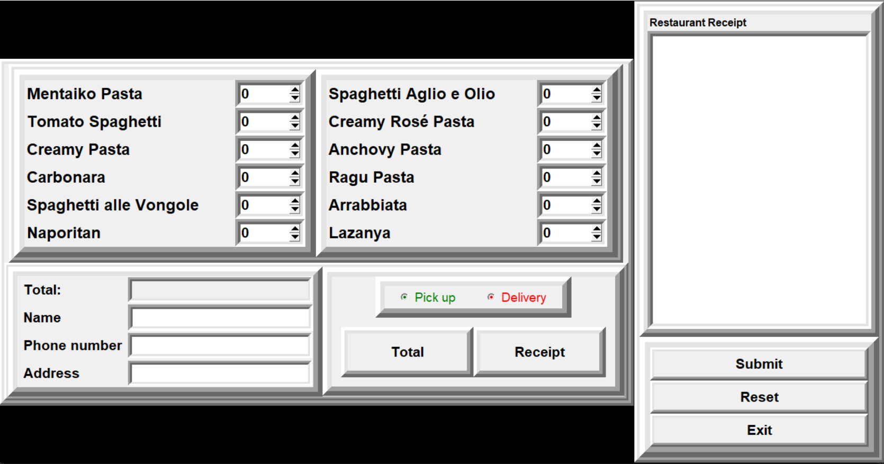

# Pasta Order Management System

Order System             |  Customer Detail System
:-------------------------:|:-------------------------:
  | 

## Overview

This project is a comprehensive pasta order management system designed for a food delivery service, featuring a graphical user interface for both order entry and administrative functions. It allows for the management of both pickup and delivery orders, including the creation, viewing, and deletion of orders, as well as the management of customer details.

## Features

- **Graphical User Interface (GUI):** Built with Tkinter, the GUI provides an intuitive interface for order processing, customer management, and viewing order summaries.
- **Order Processing:** Supports the entry of pasta orders, calculating total costs, including taxes and delivery charges, and generating order receipts.
- **Customer Management:** Enables viewing and managing customer order details, including support for both pickup and delivery options.
- **Database Integration:** Uses a SQLite database (`Detail.db`) for storing order and customer details.
- **CSV Integration:** Utilizes a CSV file (`pasta_name.csv`) to manage the list of available pasta dishes.

## Scripts

- **`main.py`:** Initializes the application's home page with navigation options.
- **`create_database.py`:** Sets up the SQLite database and tables.
- **`order_summary_gui.py`:** Displays the GUI for order summaries and customer management.
- **`delivery.py` & `pickup.py`:** Scripts for managing delivery and pickup orders, respectively.
- **`order_system.py`:** Handles the order entry process, including form submissions and receipt generation.
- **`order_submission.py`:** Inserts order data into the database.

## Setup

1. Ensure Python 3 and Tkinter are installed on your system.
2. Clone the repository and navigate to the project directory.
3. Run `python sqlite3/create_database.py` to set up the database.
4. Start the application with `python main.py`.

## Dependencies

- Python 3
- Tkinter
- SQLite3

## Contributing

Contributions to the Pasta Order Management System are welcome. Please refer to the contributing guidelines for more information.

## License

This project is licensed under the MIT License - see the LICENSE file for details.
